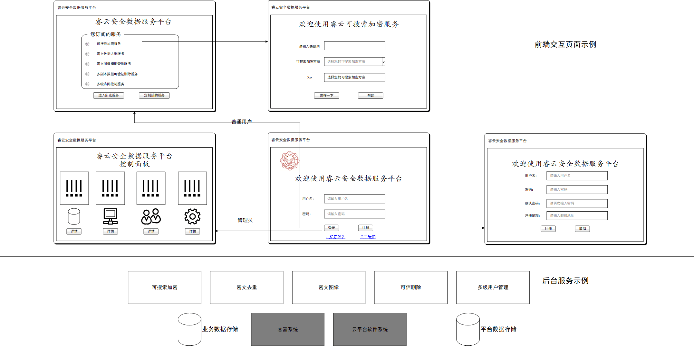

# 任务说明

在10.8日张老师下达了在云平台上部署项目的命令

1. 做一个云平台的入口（张萌、尚晶负责）

2. 如果登录身份为管理员，则进入dashboard；如果登录身份为普通用户，则进入选择服务的界面。

3. 用户可以选择的服务包括

* 可搜索加密服务（张中俊负责）

* 密文数据去重服务

* 密文数据上的区间查询服务（张中俊负责）

* 密文图像模糊查询服务（邱震尧、都林负责）

* 多副本数据可验证删除服务（邱震尧、都林负责）

* 多级访问控制服务（邱震尧、都林负责）

# 云平台的入口

在文件夹 入口文件 中

该项目是纯静态的，使用nginx作为服务器，nginx的配置文件参考 该文件夹下的nginx.conf

# 密文数据上的区间查询服务

该项目 在另外一个仓库中，QJCX_YSBH

部署的日志见 仓库 prepareenvironment中的python web开发环境搭建

# SSE

该项目在另外一个仓库中，QuanWenSouSuoWeb

部署的日志见 仓库DockersFiles